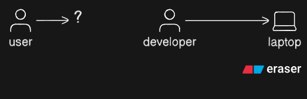
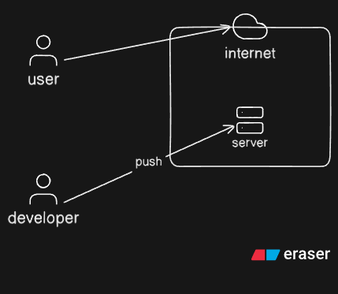

# Phase-3-Week-3

## Deployment Aplikasi

Setelah teman-teman melakukan coding, pernah nggak sih penasaran gimana caranya kode atau aplikasi kita bisa digunakan oleh orang lain?

Nah, di fase ini, kita akan fokus untuk membahas bagaimana caranya supaya kode kalian bisa diakses dan digunakan oleh orang lain, alias bagaimana aplikasi yang kalian buat bisa digunakan oleh banyak orang di luar sana.

Contohnya, seperti yang terlihat pada gambar di bawah ini, kita punya sebuah server yang terletak di cloud.

Dengan begitu, orang lain atau pengguna bisa mengakses server kita melalui internet.

Pada nantinya, kita akan belajar bagaimana cara mengirim atau "push" kode kita ke server tersebut. Dan seperti yang sudah teman-teman ketahui, proses ini akan melibatkan penggunaan version control, seperti GitHub atau GitLab.

### Perbedaan antara Local dan Cloud

#### 1. Pengembangan Lokal (Local Development)
Pada tahap ini, aplikasi dikembangkan di komputer/laptop lokal kita. Kode ditulis dan disesuaikan dengan kebutuhan.

#### 2. Deployment di Cloud (Cloud Deployment)
Setelah aplikasi siap dan diuji secara lokal, kita akan memindahkannya ke server cloud agar bisa diakses oleh banyak orang.

- **Environment Production**: Aplikasi dijalankan di server cloud yang bisa diakses oleh pengguna dari berbagai tempat.

### Kesimpulan

Pada tahap **pengembangan lokal**, aplikasi hanya bisa diakses oleh developer di komputer mereka. Setelah aplikasi di-deploy ke cloud, aplikasi dapat diakses oleh banyak orang.